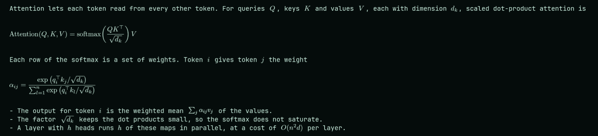

# Claude LaTeX Math

A Claude Code mod that typesets the LaTeX math in Claude's replies. Display math becomes an image in the reply. Inline math becomes a small image inside the line of text.



The screenshot shows a reply in Ghostty. The two display formulas and the inline math in the text are images.

## Install

Inside Claude Code, run:

```
/plugin marketplace add atomashevic/claude-latex-math
/plugin install latex-math
/reload-plugins
```

From a shell, the same steps are:

```bash
claude plugin marketplace add atomashevic/claude-latex-math
claude plugin install latex-math@claude-latex-math
```

Then run `/reload-plugins` inside a session, or start a new session.

## Requirements

- Claude Code with mods support. The mod is tested with version 2.1.289.
- A terminal with the kitty graphics protocol, such as [Ghostty](https://ghostty.org) or [kitty](https://sw.kovidgoyal.net/kitty/). The mod is tested with Ghostty 1.3.1 on Linux. It is not tested on macOS.
- `latex` and `dvipng` from TeX Live, with the packages `amsmath`, `amssymb`, `mathtools`, `bm`, and `preview`.
- ImageMagick 7, which provides the `magick` command.
- `bash` and `awk`.

On Arch Linux, these packages provide the tools:

```bash
sudo pacman -S texlive-bin texlive-basic texlive-latex texlive-latexrecommended texlive-latexextra imagemagick
```

In a terminal without the kitty graphics protocol, each formula shows as its LaTeX source.

## What you see

- **Display math.** `$$ ... $$`, `\[ ... \]`, and the amsmath environments `equation`, `align`, `gather`, `multline`, `alignat`, `flalign`, and `eqnarray` become an image at the same position in the reply. The image takes as many rows as the formula needs.
- **Inline math.** `$ ... $` and `\( ... \)` in a paragraph or a list item become an image one text row tall, on the baseline of the text. The mod scales a taller formula down to fit the row.
- **Inline math in other blocks.** In a table, a heading, or a quote, the mod writes inline math as Unicode text. For example, `$\beta_0 \leq x^2$` becomes `β₀ ≤ x²`.
- **Colour.** Each formula has the text colour of the Claude Code theme. With a custom theme, the mod reads `text` from the theme file. With a built-in theme, it uses the foreground colour of the terminal.
- **Errors.** A formula that LaTeX rejects shows its source. A display formula also shows the TeX error below the source.
- **Text that stays text.** Prices such as `$5 and $10`, code spans, and code fences are not math.

The mod also adds one section to the system prompt. The section tells the model that the terminal typesets math, so the model writes formulas in LaTeX.

## How it works

1. A hook on each assistant message splits the reply into text, display formulas, and inline formulas.
2. `bin/render.sh` runs `latex` and `dvipng` on each formula. It pads the PNG to whole terminal cells and writes it to `~/.cache/claude-latex-math/`. The cache key is a hash of the formula and the colour.
3. The hook draws each PNG with the `Image` element of Claude Code. The terminal reads the file and shows it through the kitty graphics protocol.
4. A paragraph that has inline math is drawn word by word in a wrapping row, so the image can sit between two words.

On the development machine, a new formula takes about 0.2 seconds and a cached formula takes about 5 milliseconds.

## Limits

- A link in a paragraph that has inline math shows as Markdown source, `[text](url)`.
- The baseline of an inline formula assumes the metrics of a typical monospace font. The value is `BASELINE` in `bin/render.sh`.
- After a theme change, a formula that is already on screen keeps its colour until Claude Code draws the message again.
- The Unicode fallback keeps the LaTeX source of a formula that has an environment or an unknown command.

## Security

The mod is local. It makes no network requests.

- It runs `latex` on formulas from the model with shell escape off (`-no-shell-escape`) and with `openin_any=p` and `openout_any=p`, which stop a formula from opening a file by an absolute path or in a parent directory.
- It reads the `theme` setting and, for a custom theme, the theme file in `~/.claude/themes/`.
- In Ghostty, it runs `ghostty +show-config` to read the foreground colour.
- It writes PNG files to `~/.cache/claude-latex-math/`, or to `$XDG_CACHE_HOME/claude-latex-math/` when that variable is set.

Run `claude plugin validate .` in the repository to see each event that the mod hooks and each call that it makes.

## Development

```bash
git clone https://github.com/atomashevic/claude-latex-math
cd claude-latex-math

# Load the mod for one session without an install
claude --plugin-dir .

# Check the mod and run the tests
claude plugin validate .
claude plugin test .
```

To render one formula from a shell:

```bash
printf '\\[ e^{i\\pi} + 1 = 0 \\]' | bin/render.sh /tmp/math euler d8d8d8 display
```

The script prints the size in cells and writes `/tmp/math/euler.png`.

## Credits

The method comes from [claude-image-view](https://github.com/jarrodwatts/claude-image-view) by Jarrod Watts, which draws pasted images with the same `Image` element.

## License

MIT. See [LICENSE](LICENSE).
