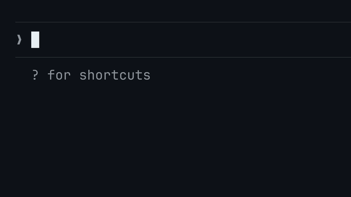

# Claude LaTeX Math

A Claude Code mod that typesets the LaTeX math in Claude's replies. Display math becomes an image in the reply. Inline math becomes a small image inside the line of text.



## Install

Inside Claude Code, run:

```
/plugin marketplace add atomashevic/claude-latex-math
/plugin install latex-math
/reload-plugins
```

From a shell, the same steps are:

```bash
claude plugin marketplace add atomashevic/claude-latex-math
claude plugin install latex-math@claude-latex-math
```

Then run `/reload-plugins` inside a session, or start a new session.

## Requirements

- Claude Code 2.1.287 or later, which runs mods. The mod is tested with 2.1.289.
- A terminal with the kitty graphics protocol: [kitty](https://sw.kovidgoyal.net/kitty/) or [Ghostty](https://ghostty.org). In any other terminal, the mod writes math as Unicode text.
- `latex`, `dvipng` and `kpsewhich` from TeX Live, with the LaTeX packages `amsmath`, `amssymb`, `mathtools`, `bm` and `preview`.
- ImageMagick 7 (`magick`) or ImageMagick 6 (`convert` and `identify`).
- `bash` and `awk`.

When a tool or a package is missing, the mod shows one notice at the start of the session and writes math as Unicode text.

Install the tools with one of these commands:

| System | Command | Tested |
| --- | --- | --- |
| Arch Linux | `sudo pacman -S texlive-bin texlive-basic texlive-latex texlive-latexrecommended texlive-latexextra imagemagick` | Yes, with Ghostty 1.3.1 |
| Debian, Ubuntu | `sudo apt install texlive-latex-recommended dvipng preview-latex-style imagemagick` | The renderer, on Ubuntu 24.04 |
| macOS | `brew install --cask basictex`, then `sudo tlmgr install dvipng preview mathtools` and `brew install imagemagick` | No |

Windows is not supported, because the renderer is a bash script.

## Try it

These prompts show what the mod does:

1. `Explain the attention mechanism in transformers, with the formulas.` The reply has display formulas for scaled dot-product attention and inline symbols such as `$d_k$` in the text.
2. `Derive the least-squares estimator in matrix form, step by step.` The reply has a chain of display formulas, and an `align` environment if Claude uses one.
3. `Write Maxwell's equations in differential form and explain each term.` The reply has four display formulas and inline vector operators in the explanations.

## Settings

Change the options in `/config`, where each option is one row under the plugin's name. From a shell, `claude plugin configure latex-math@claude-latex-math` shows the options, and `echo '{"images":"off"}' | claude plugin configure latex-math@claude-latex-math --values-stdin` sets one.

| Option | Values | Default | What it does |
| --- | --- | --- | --- |
| `images` | `auto`, `on`, `off` | `auto` | `auto` draws images in kitty and Ghostty and writes Unicode text in other terminals. `on` draws images in a terminal that the mod does not recognise, such as kitty over SSH with `TERM` set to another value. `off` always writes Unicode text. |
| `inline` | `image`, `unicode` | `image` | How inline math is drawn when images are on. |
| `promptSection` | `true`, `false` | `true` | Whether the system prompt tells Claude that math is typeset. |
| `scale` | 0.5 to 2 | 1 | The size of display math, as a multiple of the default size. |
| `cacheSizeMB` | 1 to 10000 | 100 | The largest size of the image cache, in MB. |

## What you see

- **Display math.** `$$ ... $$`, `\[ ... \]`, and the amsmath environments `equation`, `align`, `gather`, `multline`, `alignat`, `flalign` and `eqnarray` become an image at the same position in the reply. The image takes as many rows as the formula needs.
- **Inline math.** `$ ... $` and `\( ... \)` in a paragraph or a list item become an image one text row tall, on the baseline of the text. The mod scales a taller formula down to fit the row.
- **Inline math in other blocks.** In a table, a heading or a quote, the mod writes inline math as Unicode text. For example, `$\beta_0 \leq x^2$` becomes `β₀ ≤ x²`.
- **Colour.** Each formula has the text colour of the Claude Code theme. With a custom theme, the mod reads `text` from the theme file. With a built-in theme, it uses the foreground colour of the terminal.
- **Formulas that are not rendered.** A formula that LaTeX rejects, or that has a command outside the [list of math commands](#formulas-are-untrusted-input), shows its source. A display formula also shows the reason below the source.
- **Text that stays text.** Prices such as `$5 and $10`, code spans and code fences are not math.

When the mod writes math as text, inline and display math become Unicode. A display formula that Unicode cannot hold, such as a matrix, becomes a LaTeX code block. A reply that needs more than 60 different formulas typeset is always written as text, so that one long derivation does not start 60 LaTeX runs.

## What the mod tells Claude

When images are on and `promptSection` is `true`, the mod adds this section to the system prompt:

```text
# Math rendering
This terminal typesets LaTeX math as images. Display math (`$$ ... $$` on its own lines, or an amsmath environment such as `\begin{align} ... \end{align}`) is drawn in place at full size. Inline math (`$...$`) in a paragraph or a list item is drawn inside the line, one text row tall, so keep it to expressions that fit a line and put tall formulas (stacked fractions, matrices, sums with limits above and below) in display math. In a table, a heading or a quote, inline math is written as Unicode text instead. Use only the commands of LaTeX and amsmath, and define no macros: a formula with any other command is shown as source.
```

With `inline` set to `unicode`, the two sentences about inline math are replaced by this one:

```text
Inline math (`$...$`) is written as Unicode text, so keep it to short expressions (symbols, subscripts, superscripts, simple fractions) and put larger formulas in display math.
```

The mod adds nothing to the system prompt when it writes math as text, in Claude Desktop, or in the VS Code chat panel.

## How it works

1. When a session starts in the terminal, the mod decides once whether to draw images. It reads the terminal from environment variables, as Claude Code does, and runs `bin/render.sh --check` to find missing tools. Then it deletes the least recently used images until the cache is under `cacheSizeMB`.
2. A hook on each assistant message splits the reply into text, display formulas and inline formulas.
3. The mod checks each formula against its list of math commands, and sends it to the renderer only when every command is on the list.
4. `bin/render.sh` runs `latex` and `dvipng` on each formula. It pads the PNG to whole terminal cells and writes it to `~/.cache/claude-latex-math/`. The file name is a hash of the formula, the colour and the scale.
5. The hook draws each PNG with the `Image` element of Claude Code. The terminal reads the file and shows it through the kitty graphics protocol. Over SSH, the terminal cannot read the file, so the mod sends the PNG bytes instead.
6. A paragraph that has inline math is drawn word by word in a wrapping row, so the image can sit between two words.

On the development machine, a new formula takes about 0.2 seconds and a cached formula takes about 5 milliseconds.

## Troubleshooting

**Formulas show as Unicode text in kitty or Ghostty.** Claude Code draws no images inside tmux or screen, or in a background session, so the mod writes Unicode text there. To make Claude Code draw images anyway, set `CLAUDE_CODE_FORCE_TERMINAL_IMAGES=1` in the `env` block of `~/.claude/settings.json` and start a new session. Whether the images then show depends on the terminal. Outside tmux and screen, the mod can also miss a terminal whose `TERM` and `TERM_PROGRAM` were changed. Set `images` to `on` for that terminal.

**A notice says that a tool was not found.** Install the tools that the notice names, as the table in [Requirements](#requirements) shows, and start a new session. To see what is missing, run the check yourself, with the installed version in the path:

```bash
bash ~/.claude/plugins/cache/claude-latex-math/latex-math/0.3.0/bin/render.sh --check
```

The command prints an empty line and exits with 0 when every tool and package is present.

**A formula shows its source and a line that starts with `not rendered:`.** The line gives the reason. Either LaTeX rejected the formula, and the line has the TeX error, or the formula has a command that is not on the list of math commands. Ask Claude to write the formula again with standard commands. If a standard math command is missing from the list, open an issue.

**Formulas show as dim LaTeX source.** The mod chose images, and the terminal cannot draw them. Set `images` to `off` to get Unicode text instead.

**Formulas have the wrong colour.** The mod reads the colour when it draws a reply. After you change the theme, new replies get the new colour.

**The cache uses too much disk space.** Lower `cacheSizeMB`, or delete `~/.cache/claude-latex-math`. The mod renders each formula again when it needs it.

**Turn the mod off.** Disable `latex-math` in the **Installed** tab of `/plugin`.

## Limits

- A link in a paragraph that has inline math shows as Markdown source, `[text](url)`.
- The baseline of an inline formula assumes the metrics of a typical monospace font. The value is `BASELINE` in `bin/render.sh`.
- After a theme change, a formula that is already on screen keeps its colour until Claude Code draws the message again.
- The Unicode fallback keeps the LaTeX source of a formula that has an environment or an unknown command.
- The mod renders only the math commands of LaTeX, amsmath, amssymb, mathtools and bm. A formula that defines a macro, with `\newcommand` or `\def`, is not rendered.
- The mod reads the terminal from environment variables. Claude Code also asks the terminal for its version, which a mod cannot do. In a kitty older than 0.28, the mod chooses images, and Claude Code shows each formula as dim LaTeX source.

## Privacy

The mod runs only on your machine and sends no data anywhere. [PRIVACY.md](PRIVACY.md) lists what it reads, what it writes and how long the files stay.

## What the mod runs, reads and sends

The mod makes no network requests and downloads nothing. Everything in this section stays on your computer.

### What its hooks change

The mod has three hooks.

- **`ui.render` on assistant messages.** It changes how a reply that has math is drawn in the terminal: each formula becomes an image or Unicode text. It does not change the message itself. The transcript and the conversation that Claude sees keep the LaTeX source.
- **`prompt.compose`.** It adds one section to the end of the system prompt, quoted in [What the mod tells Claude](#what-the-mod-tells-claude), when images are on and `promptSection` is `true`. It changes and removes no other section.
- **`session.start`.** It changes nothing in the session. In a terminal session it decides how to draw math, shows the notice about missing tools, and trims the image cache.

The mod does not change your prompts, tool calls, permissions or settings.

### Programs it runs

The mod starts four commands with `$.process.run`. `<plugin>` is the plugin's folder. `<stem>` is the image's file name without `.png`: a hash of the formula, the colour and the scale.

| Command | When | Why |
| --- | --- | --- |
| `bash <plugin>/bin/render.sh <cache folder> <stem> <colour> <display or inline> <scale>` | Once for each new formula | Typesets the formula. The script runs `latex`, `dvipng` and ImageMagick (`magick`, or `convert` and `identify`) in a temporary folder, and deletes the folder when it ends. |
| `bash <plugin>/bin/render.sh --check` | Once when a terminal session starts | Lists missing tools and LaTeX packages. The script runs `command -v` and `kpsewhich`. |
| `rm -f -- <cache files>` | Once when a terminal session starts, if the cache is over `cacheSizeMB` | Deletes the least recently used images. It deletes only files in the cache folder whose names the renderer made. |
| `ghostty +show-config` | In Ghostty, at most once every 5 seconds while it draws replies | Reads the terminal's foreground colour. |

The arguments that vary are the ones in angle brackets: a folder path, a hash, a colour of six hex digits, a mode, a number, and paths of files in the cache folder. The mod builds no command from a formula or from any other text of a reply. A formula reaches the renderer only on its standard input, as the body of a LaTeX document.

The renderer is a shell script because one formula takes `latex`, `dvipng` and ImageMagick in a temporary folder, and the mods API has no call that deletes a file. Every command name in `bin/render.sh` is written in the script.

### Formulas are untrusted input

A formula comes from the model, and LaTeX is a programming language. The mod limits what a formula can do in four ways.

- **Only math commands.** The mod sends a formula to LaTeX only when every command in it is on a list of about 760 math commands and 57 environments, in `hooks/commands.ts`. The list has the symbols and the structural commands of LaTeX, amsmath, amssymb, mathtools and bm. It has no command that reads a file, defines a macro, or changes how LaTeX reads its input. A formula with any other command shows as its source.
- **No programs.** `latex` runs with shell escape off (`-no-shell-escape`), and `dvipng` runs with Ghostscript off (`--nogs`).
- **No writes outside the work folder.** `latex` runs with `openout_any=p`. The one listed command that writes is `\label`, which adds a line to LaTeX's own `.aux` file in that folder.
- **Limits on time and size.** `latex` and `dvipng` stop after 20 seconds, and a picture larger than 255 terminal cells in either direction is refused.

LaTeX itself does not limit which files a formula can read: TeX Live 2026 made its `openin_any` setting a no-op. The command list is what keeps a formula from reading a file. `tools/commands.py probe` tests the list on the installed LaTeX. It calls each listed command with a canary command name and a canary file in every argument position, and it fails when LaTeX runs the name, opens the file, or leaves its input rules changed. CI runs the probe on every pull request and on every push to `main`.

### What it sends, and where

- The LaTeX of each formula goes to `bin/render.sh` on its standard input.
- Each image goes to the terminal through Claude Code's `Image` element: as a file path, or as PNG bytes over SSH.
- When a tool is missing, one notice line goes to the transcript with `$.ui.log`. Claude does not see it.
- The system prompt section goes to Claude inside Claude Code's own requests to Anthropic. The mod adds the section and sends nothing itself.

### What it reads

- Claude's replies, as Claude Code draws them.
- Two kinds of file, with `$.fs.read`. From a custom theme file in `~/.claude/themes/`, it takes the `text` colour, or the name of the base theme when the file sets no text colour, to choose the `<colour>` argument of the renderer. Over SSH, it reads each image file that the renderer wrote, and the bytes go to the terminal. No other file content goes to a program or leaves the mod.
- The `theme` row of `/config`, with `$.config.list`. It does not read the rest of your settings.
- The output of `ghostty +show-config`, from which it takes the foreground colour.
- The environment variables `HOME`, `XDG_CACHE_HOME` and `CLAUDE_CONFIG_DIR`, to find folders. `TERM`, `TERM_PROGRAM`, `KITTY_WINDOW_ID`, `TMUX`, `STY`, `CLAUDE_CODE_SESSION_KIND` and `CLAUDE_CODE_FORCE_TERMINAL_IMAGES`, to learn whether the terminal draws images. `SSH_CONNECTION` and `SSH_TTY`, to learn whether the terminal is on another computer. None of these is a credential, and the mod sends none of them anywhere.
- The file list of the cache folder, and whether an image file still exists.

The mod reads no token, API key or password, from the environment or from a file.

It writes images to `~/.cache/claude-latex-math/`, or to `$XDG_CACHE_HOME/claude-latex-math/` when that variable is set. Run `claude plugin validate .` in the repository to see each event that the mod hooks and each call that it makes.

## Security

To report a vulnerability, see [SECURITY.md](SECURITY.md).

## Support

Open an issue at [github.com/atomashevic/claude-latex-math/issues](https://github.com/atomashevic/claude-latex-math/issues). Give your terminal, your system, the output of `claude --version`, and the formula that fails.

## Development

```bash
git clone https://github.com/atomashevic/claude-latex-math
cd claude-latex-math

# Load the mod for one session without an install
claude --plugin-dir .

# Check the mod and run its tests
claude plugin validate .
claude plugin test .

# Run the renderer on real formulas
tests/render.test.sh

# Probe the list of math commands on your LaTeX
python3 tools/commands.py probe
```

CI runs the same commands on every push and pull request, and runs `shellcheck` on the shell scripts.

`tools/commands.py generate` writes `hooks/commands.ts`, the list of math commands. To allow one more command, add it to the lists in that script, run `generate`, then run `probe`.

To render one formula from a shell:

```bash
printf '\\[ e^{i\\pi} + 1 = 0 \\]' | bin/render.sh /tmp/math euler d8d8d8 display
```

The script prints the size in cells and writes `/tmp/math/euler.png`.

To render the demo animation, run `demo/make_demo.py`, then `demo/encode.sh`. They need Python with Pillow and ffmpeg. The animation in this README is the 720 px GIF that `demo/encode.sh` writes, because the plugin directory accepts no file over 5 MiB.

`demo/make_icon.py` draws the plugin icon from one formula typeset by LaTeX.

[CHANGELOG.md](CHANGELOG.md) lists the changes in each version.

## Credits

The method comes from [claude-image-view](https://github.com/jarrodwatts/claude-image-view) by Jarrod Watts, which draws pasted images with the same `Image` element.

## License

MIT. See [LICENSE](LICENSE).
